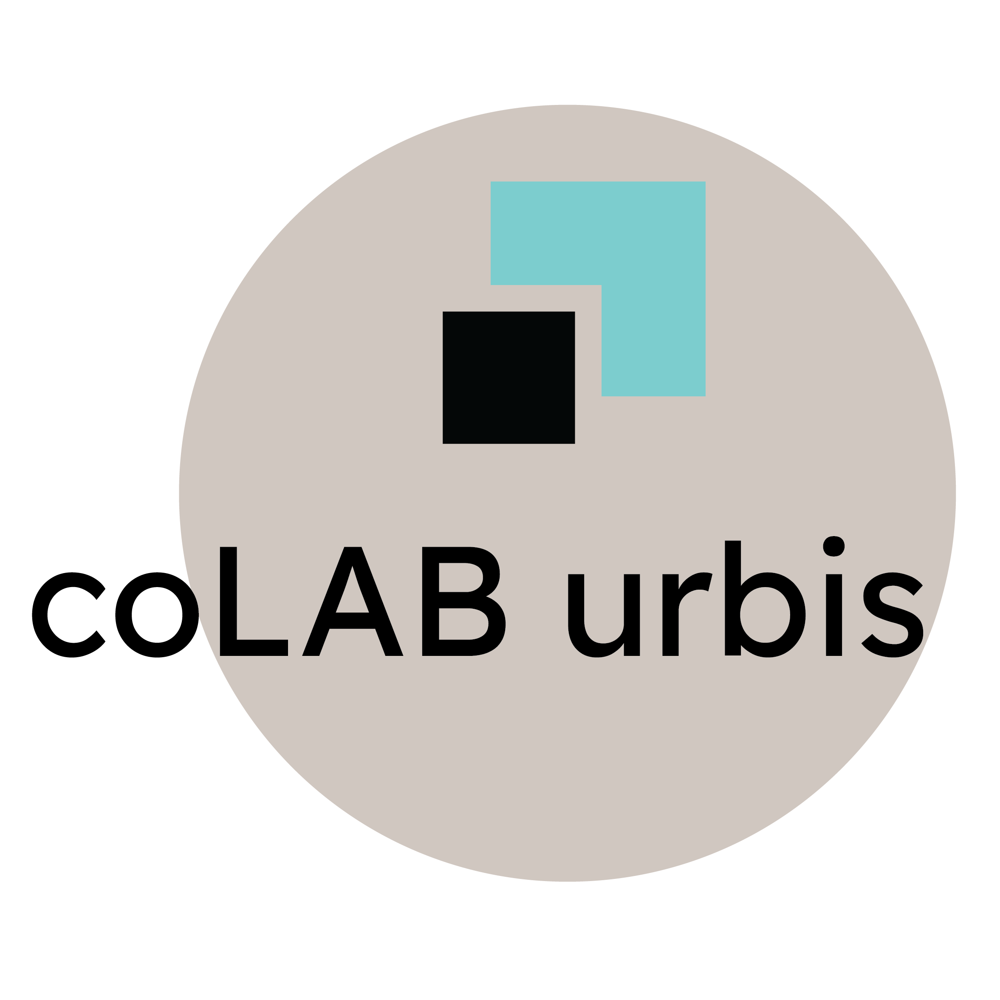

<h1 align = "center">
 

  coLABurbis
</h1>

 An open-source urban project! 

<h3> Requirements: </h3>

<ul>
  <li> Github: https://www.colaburbis.com.br/comoajudar-github</li>
  <li> QGIS: https://www.colaburbis.com.br/comoajudar-qgis </li>
</ul>

> <b> You can participate without knowing these tools! </b>
> <a href="https://bit.ly/2m0sUVB"> Click here to earn a land lot! </a>
> <a href="https://bit.ly/2ktHLXZ"> Click here to enter the team! </a>

<h3> About the project </h3>

 CoLAB urbis is a undergraduate thesis for the Faculty of Architecture and Urbanism of the University of Brasilia - UnB. From an organic view of Urbanism, which is, the city formed from the spontaneous logics of society, this project thesis aims to present a development strategy, a model of urban occupation, for an uninhabited area in the interior of Goias, in the municipality of Goianira. Goianira is 220 km away from Brasilia, the capital of Brazil. 

 In its first phase the owner of the land lot (Initiators and Creators) earn it by developing some sort of work, such as business, housing or agriculture. In addition, the lots are self-sufficient, meaning that the lot's owner needs to solve the infrastructure issues (roads, waste disposal, sewage, drinking water and energy) within its lot. The Creators then will analyze the demands of lots and draw them in the city, forming the roads, blocks and neighborhoods.

 
<b> Created by <a href="https://github.com/sofiaveras/"> @sofiaveras </a> - <a href = "https://www.linkedin.com/in/sofia-veras- 703a31138 / "> Linkedin </a> </b>

<h3> How to participate? </h3>
<ol>
  <li> Visit the  to learn more about the project. </li>
  <li> Click <i> <b> I want to participate! </b> </i>. </li>
  <li> Select the desired profile (<i> Starter </i> or <i> Creator </i>). </li>
  <li> Complete the form according to your profile. </li>
  <li> Visit our guides and participate in the project on Github. </li>
</ol>

> ℹ️ <b>Important</b>: You can also participate directly in this repository if you want!

<h3> License </h3>
This project is licensed under the <b> GNU General Public License v3.0 </b>
